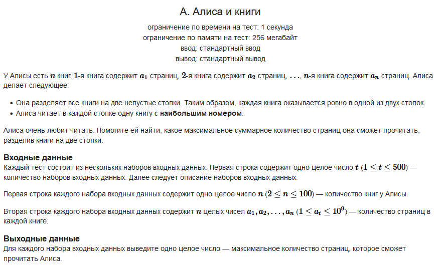

#### Условие задачи:



Обязательная ссылка на [CodeForces](https://codeforces.com/contest/1978/problem/A?locale=ru)

#### Решение:

```
static void Main(string[] args)
{
    int sets = Convert.ToInt32(Console.ReadLine());
    for (int i = 0; i < sets; i++) 
    {
        int length = Convert.ToInt32(Console.ReadLine());
        int[] arr = new int[length];
        
        string[] numstring = Console.ReadLine().Split(' ');
        for (int j = 0; j < length; j++) 
            arr[j] = Convert.ToInt32(numstring[j]);
 
        int max = arr[0];
        int sum = 0;
        for (int j = 0; j < length-1; j++)
            if (arr[j] > max)
                max = arr[j];
        
        sum = max + arr[length-1];
        Console.WriteLine(sum);
    }
}
```