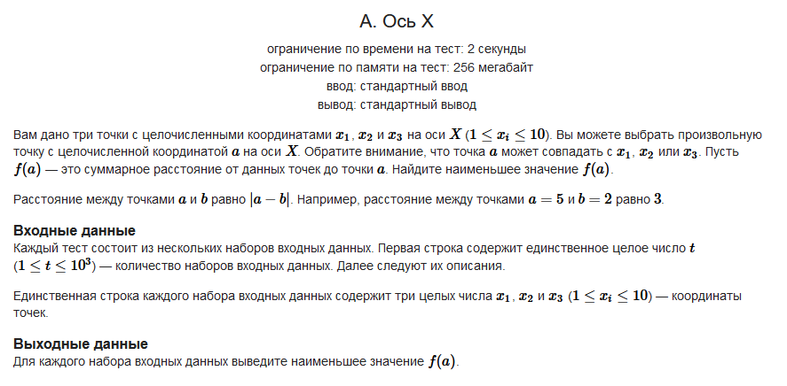

#### Условие задачи:



Обязательная ссылка на [CodeForces](https://codeforces.com/contest/1986/problem/A?locale=ru)

#### Решение:

```
static void Main(string[] args)
{
    int sets = Convert.ToInt32(Console.ReadLine());
    for (int i = 0; i < sets; i++) 
    {
        int[] arr = new int[3];
        string[] numstring = Console.ReadLine().Split(' ');
 
        List <int> list = new List <int>();
        for (int j = 0; j < 3; j++)
            list.Add(Convert.ToInt32(numstring[j]));
 
        list.Sort();
            
        int sum = int.MaxValue;
        int a = list[0];
        for (int j = list[0]; j <= list[2]; j++)
        {
            int testsum = Math.Abs(j - list[2]) + Math.Abs(j - list[0]) + Math.Abs(j - list[1]);
            if (testsum < sum)
            {
                sum = testsum;
                a = j;
            }
        }
 
        Console.WriteLine(sum);
    }
}
```