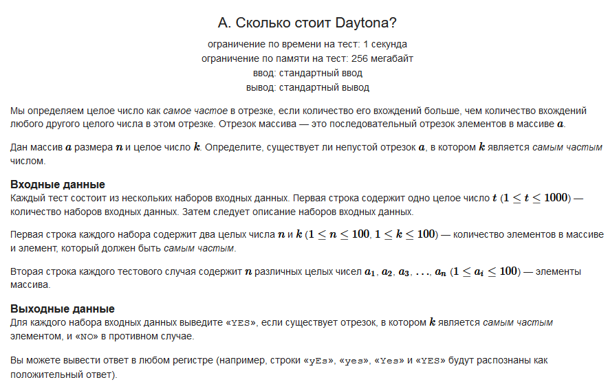

#### Условие задачи:



Обязательная ссылка на [CodeForces](https://codeforces.com/contest/1878/problem/A?locale=ru)

#### Решение:

```
internal class Program
{
    static void Main(string[] args)
    {
        int sets = Convert.ToInt32(Console.ReadLine());
        for (int i = 0; i < sets; i++) 
        {
            string[] tempData = Console.ReadLine().Split();
            int size = Convert.ToInt32(tempData[0]);
            int k = Convert.ToInt32(tempData[1]);
            string[] tempArr = Console.ReadLine().Split();
            int counter = 0;
            for (int j = 0; j < size; j++)
                if (Convert.ToInt32(tempArr[j]) == k)
                {
                    counter++;
                    break;
                }

            if (counter == 0)
                Console.WriteLine("NO");
            else
                Console.WriteLine("YES");
            }
        }
    }
```