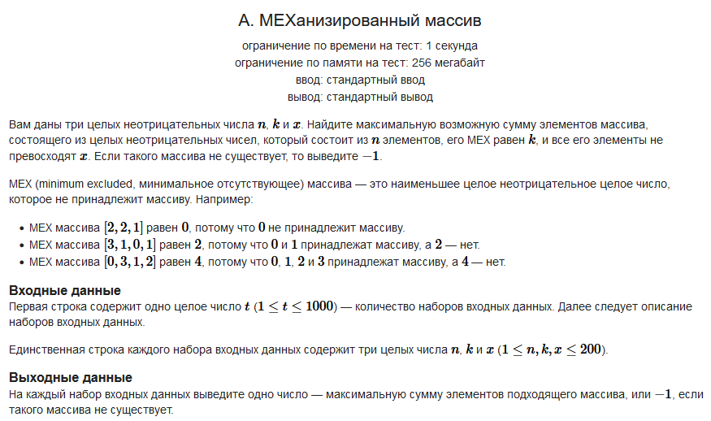

#### Условие задачи:



Обязательная ссылка на [CodeForces](https://codeforces.com/contest/1870/problem/A?locale=ru)

#### Решение:

```
static void Main()
{
    int sets = Convert.ToInt32(Console.ReadLine());
    for (int i = 0; i < sets; i++) 
    { 
        string[] s = Console.ReadLine().Split();
        int n = Convert.ToInt32(s[0]);
        int k = Convert.ToInt32(s[1]);
        int x = Convert.ToInt32(s[2]);
 
        if (k > n || k > (x + 1))
        {
            Console.WriteLine(-1);
            continue;
        }

        int sum = 0;
        for (int j = 0; j < k; j++) 
            sum += j;
        
        if (x == k)
            sum += (x - 1) * (n - k);
        else 
            sum += x * (n - k);
        
        Console.WriteLine(sum);
    }
}
```