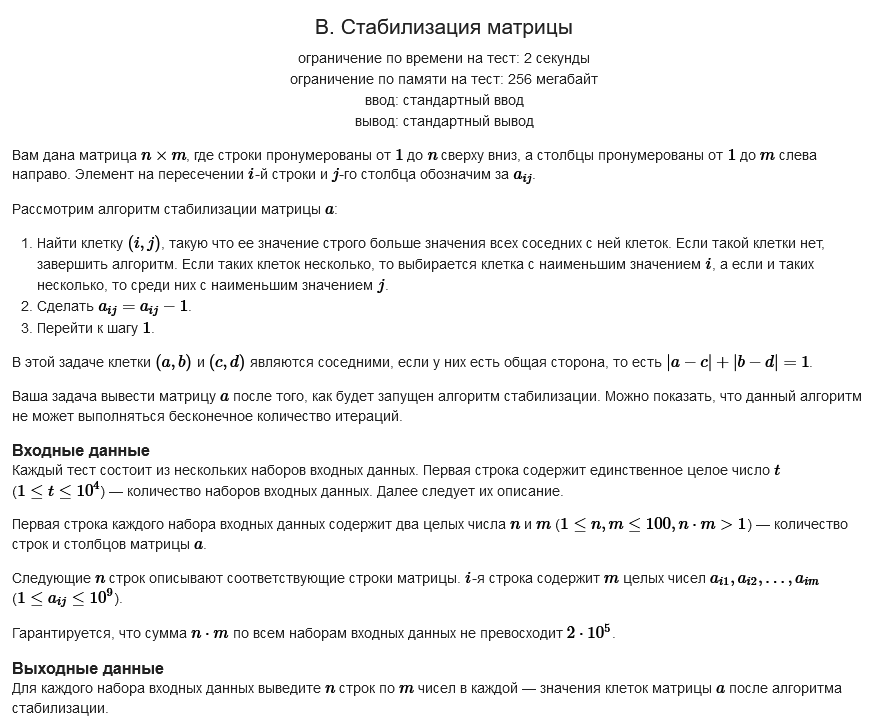

#### Условие задачи:



Обязательная ссылка на [CodeForces](https://codeforces.com/contest/1986/problem/B?locale=ru)

#### Решение:

```
static void Main(string[] args)
{
    int sets = Convert.ToInt32(Console.ReadLine());
    for (int i = 0; i < sets; i++) 
    {
        string[] numstring = Console.ReadLine().Split(' ');
        int n = Convert.ToInt32(numstring[0]);
        int m = Convert.ToInt32(numstring[1]);
 
        var arr = new int[n, m];
        for (int j = 0; j < n; j++)
        {
            string[] arrstring = Console.ReadLine().Split(' ');
            for (int k = 0; k < m; k++)
                rr[j,k] = Convert.ToInt32(arrstring[k]);
        }
 
        if (n == 1 && m == 1)
        {
            Console.WriteLine(arr[0,0]);
            continue;
        }
 
        bool flag = false;
              
        do
        {
            flag = false;
            for (int k = 0; k < n; k++)
            {
 
                for (int j = 0; j < m; j++)
                {
                    if (!flag)
                    {
                        int a, b,c, d;
                        a = b = c = d = 0;
                        int max = int.MaxValue;

                        if (k - 1 >= 0)
                            if (arr[k, j] <= arr[k - 1, j]) continue;
                            else a = arr[k - 1, j];
 
                        if (j - 1 >= 0)
                            if (arr[k, j] <= arr[k, j - 1]) continue;
                            else b = arr[k, j - 1];
 
                        if (j + 1 < m)
                            if (arr[k, j] <= arr[k, j + 1])continue;
                            else c = arr[k, j + 1];
 
                        if (k + 1 < n)
                            if (arr[k, j] <= arr[k + 1, j]) continue;
                            else d = arr[ k + 1, j];
 
                        flag = true;
                        arr[k, j] = Math.Max(Math.Max(a,b), Math.Max(c,d));
                        break;
 
                    }
                }
                if (flag) break;
 
            }
        } while (flag);
 
        for (int k = 0; k < n; k++)
        {
            for (int j = 0; j < m; j++)
                if (j != m - 1) Console.Write(arr[k, j] + " ");
                else { Console.Write(arr[k, j]); Console.WriteLine(); }
        }
    }
}
```