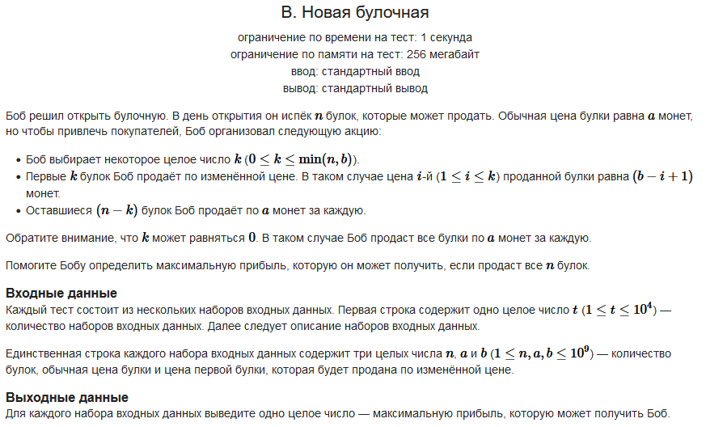

#### Условие задачи:



Обязательная ссылка на [CodeForces](https://codeforces.com/contest/1978/problem/B?locale=ru)

#### Решение:

```
static void Main(string[] args)
{
    int sets = Convert.ToInt32(Console.ReadLine());
    for (int i = 0; i < sets; i++) 
    {
        string[] numstring = Console.ReadLine().Split(' ');
        int n = Convert.ToInt32(numstring[0]);
        int a = Convert.ToInt32(numstring[1]);
        int b = Convert.ToInt32(numstring[2]);
        long sum = 0;
        long k = 0;

        if (b > a)
            if (b - a <= n)
                k = b - a;
            else
                k = n;

        sum += k * (b + b + 1 - k)/2;
        sum += (n - k) * a;
 
        Console.WriteLine(sum);
    }
}
```